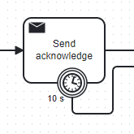

[


# C8-execute-usertask-with-result

# Principle

When a call to "execute a user task" is made via the API, the API sends the command and gives back the control.
The execution is done asynchronously by Zeebe.

Imagine you want to block the thread during this execution, waiting until the process reaches a certain point.
For example, the process calls a service to book a concert ticket, and you want to give the reservation result back to the API.
The thread must be blocked while waiting for this point, and then the process variable (reservation number) must be collected.

It is the role of this library.
There are two use cases:
* After a user task, block the thread and wait for a certain point in the process
* After a task is created, block the thread.

Note: for the second user, an API "createWithResult" exists, but this API has two limitations:
* it waits until the end of the process, not until the process reaches a milestone
* if the execution is over the duration timeout, it returns an exception and not the process instance created. If you want to cancel the process instance because it's too long, it is impossible.

# Two implementations

Two implementations are available:

* WithResultAPITaskList. This implementation uses the TaskList API to claim and execute the task, and in the ScenarioUserTask method, TaskList is used to search the task
* WithResultAPIZeebe : the new Zeebe API is used (https://docs.camunda.io/docs/apis-tools/camunda-api-rest/specifications/query-user-tasks-alpha/)

Attention: To use the new ZeebeAPI, `CAMUNDA_REST_QUERY_ENABLED` must be set to "true," and port 8080 must be accessible.


# User Task With Result
A user task is present in the process, and the application wants to call an API that will wait until the process instance passes the task "log."


The API is

```java
 /**
   * executeTaskWithResult
   *
   * @param userTask            user task to execute
   * @param assignUser          the user wasn't assigned to the user task, so do it
   * @param userName            userName to execute the user task
   * @param variables           Variables to update the task at completion
   * @param timeoutDurationInMs maximum duration time after the ExceptionWithResult.timeOut is true
   * @return the process variable
   * @throws Exception
   */
  public ExecuteWithResult executeTaskWithResult(Task userTask,
                                                 boolean assignUser,
                                                 String userName,
                                                 Map<String, Object> variables,
                                                 long timeoutDurationInMs) throws Exception

```

For example, it can be called via
```java
TaskWithResult.ExecuteWithResult executeWithResult = taskWithResult.executeTaskWithResult(userTask,
      true,
      "demo",
      userVariable, 
      10000L);
```


## How to instrument the process

A marker must be placed when the result should return. A BPMN Send Message task, a service task, or a listener in 8.6 or after is placed in the process.
It must register the type
```feel
"end-result-"+jobKey
```


*Different implementation*
The choice of implementation matters.

* BPMN Send Message: this is the most appropriate event. From the process point of view, you send a message to another application.
  To add a boundary timer event (see below), you need to use the Task Send Message. A Send Message requires the implementation of a worker.

* Service task: The implementation requires a worker to do it, too. The return is visible in the diagram. A Boundary Timer Event can be added too (see below)

* Listener: The listener is interested because the implementation is not directly visible in the process.
  It may be interesting from a business point of view, considering this is a technical implementation, not a business need. Attention: The START listener blocks the Boundary Timer Event.
  An END listener must be used.


## How it's work
In Zeebe, the call is asynchronous. So when the Zeebe API `completeTask` is called, the thread is free and can continue the execution.

So, the idea is to block it on an object
```java
   // Now, we block the thread and wait for a result
    lockObjectTransporter.waitForResult(timeoutDurationInMs);
```

This object was created just before and saved in a map. The Key is the `jobKey`, which is unique.
```java
 LockObjectTransporter lockObjectTransporter = new LockObjectTransporter();
    lockObjectTransporter.jobKey = jobKey;
    synchronized (lockObjectsMap) {
      lockObjectsMap.put(jobKey, lockObjectTransporter);
    }

```

The object is notified in the worker:
```java
  private class HandleMarker implements JobHandler {
    public void handle(JobClient jobClient, ActivatedJob activatedJob) throws Exception {
      // Get the variable "lockKey"
      String jobKey = (String) activatedJob.getVariable("jobKey");
      logger.info("Handle marker for jobKey[{}]", jobKey);
      LockObjectTransporter lockObjectTransporter = lockObjectsMap.get(jobKey);

      if (lockObjectTransporter == null) {
        logger.error("No object for jobKey[{}]", jobKey);
        return;
      }
      lockObjectTransporter.processVariables = activatedJob.getVariablesAsMap();
      logger.debug("HandleMarker jobKey[{}] variables[{}]", jobKey, lockObjectTransporter.processVariables);

      // Notify the thread waiting on this item
      lockObjectTransporter.notifyResult();
    }
```

When activated, the worker must retrieve the waiting object in the Map—the `jobKey` must be passed as a process variable.

We need to activate the handler call to ensure this is on the same Java machine. This method can be implemented in an application deployed in a replica.
The topic contains the job Key to ensure the worker is dynamic and the method for registering the new worker.
.
```java
   JobWorker worker = zeebeClient.newWorker()
        .jobType("end-result-" + jobKey)
        .handler(handleMarker)
        .streamEnabled(true)
        .open();
```
This is why the topic contains the `jobKey`. The worker will run on the same Java machine.

The second advantage is in execution time. Instead of having one worker running the entire management, there is one worker per execution.
The worker will be notified faster when the process instance reaches the task.

# Scalability
This implementation is scalable. If multiple pods are using this implementation because the pod that executes the API generates a unique number and starts the worker on this number,
you can be sure the same pod will execute it and unlock the API.

# Weakness of the implementation
The process instance is waiting for a worker and a unique worker due to the job type, which contains a unique number. If the pod that sends the request dies,
the worker will never be executed. Even if the pod restarts, it does not know which worker it has to recreate.
The process instance will be blocked forever.

To avoid that, a boundary timer event must be placed on the service task or the BPMN Send Task. The boundary event will unblock the process instance.



> Attention: A START listener blocks the service task forever, and the Boundary timer event has no impact on it. The timer event can unblock an END listener.

# Create a process instance with the result

The same behavior can be implemented for the Create process instance.
The advantages between the ZeebeAPI and the Result are:
* ZeebeAPI withResult waits for the end of the process instance. This mechanism can be placed in the process and will trigger when the process instance reaches the marker, not at the end of the process instance
* If the timeout fires, ZeebeAPI will return an exception without creating the process instance. If the use case is to cancel the process instance because it takes too much time, this is not possible. This API will send back the process instance created.

Note: this implementation is not done at this moment


# Demonstrate

Deploy processes `ExecuteUserTaskWithResult.bpmn` (located under `src/test/resources`).

Start the "io.camunda.executewithresult.ExecuteApplication" Spring boot application.

This application will execute "io.camunda.executewithresult.scenario.ScenarioUseTask". According the `modeExecution` stored in the Yaml file under the variable `usertaskwithresult.modeExecution`, it will run differenc scenario.

