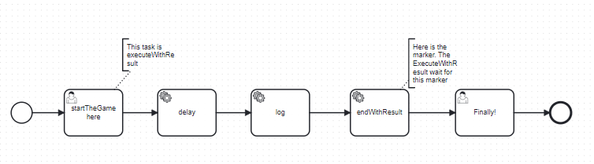
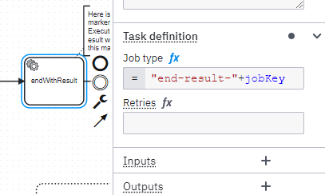

# C8-execute-usertask-with-result!

# Principle

Via the API, when a call to "execute a user task" is perform, the API send the command and give back the control.
The execution is done asynchronously by Zeebe.

Imagine you want to block the thread during this execution, waiting until the process reach a point in the process.
For example, the process call a service to book a ticket for a concert, and you want to give back the result of the reservation to the API.
The thread must be block, waiting for this point, and then collect the process variable (the reservation number).

This is the role of this library.
There is two use case:
* after a user task, block the thread and wait for a certain point in the process
* after a task creation, block the thread.

Note: for the second user, an API "createWithResult" exist, but this API has two limitations:
* it waits until the end of the process, not until the process reach a milestone
* if the execution is over the duration timeout, it returns an exception, and not the process instance created. It you want to cancel the process instance because it's too long, then it is not possible.


# User Task With Result
A user task is present in the process, and the application want to call an API which will wait until the process instance pass the task "log".



The API is 

```java
 /**
   * executeTaskWithResult
   *
   * @param userTask            user task to execute
   * @param assignUser          the user wasn't assign to the user task, so do it
   * @param userName            userName to execute the user task
   * @param variables           Variables to update the task at completion
   * @param timeoutDurationInMs maximum duration time, after the ExceptionWithResult.timeOut is true
   * @return the process variable
   * @throws Exception
   */
  public ExecuteWithResult executeTaskWithResult(Task userTask,
                                                 boolean assignUser,
                                                 String userName,
                                                 Map<String, Object> variables,
                                                 long timeoutDurationInMs) throws Exception

```

For example, it can be called via
```java
TaskWithResult.ExecuteWithResult executeWithResult = taskWithResult.executeTaskWithResult(userTask,
      true,
      "demo",
      userVariable, 
      10000L);
```


## How to instrument the process

A marker must be place when the result should return. A service task (or a listener in 8.6 or after) is placed in the process.
It must register the type 
```feel
"end-result-"+jobKey
```



## How it's work
In Zeebe, the call is asynchronous. So when the Zeebe API `completeTask`is call, the thread is free and continue the execution.

So, the idea is to block it on an object
```java
   // Now, we block the thread and wait for a result
    lockObjectTransporter.waitForResult(timeoutDurationInMs);
```

This object is created just before, and saved in a Map. The key is the jobKey, which is unique.
```java
 LockObjectTransporter lockObjectTransporter = new LockObjectTransporter();
    lockObjectTransporter.jobKey = jobKey;
    synchronized (lockObjectsMap) {
      lockObjectsMap.put(jobKey, lockObjectTransporter);
    }

```

The object is notified in the worker:
```java
  private class HandleMarker implements JobHandler {
    public void handle(JobClient jobClient, ActivatedJob activatedJob) throws Exception {
      // Get the variable "lockKey"
      String jobKey = (String) activatedJob.getVariable("jobKey");
      logger.info("Handle marker for jobKey[{}]", jobKey);
      LockObjectTransporter lockObjectTransporter = lockObjectsMap.get(jobKey);

      if (lockObjectTransporter == null) {
        logger.error("No object for jobKey[{}]", jobKey);
        return;
      }
      lockObjectTransporter.processVariables = activatedJob.getVariablesAsMap();
      logger.debug("HandleMarker jobKey[{}] variables[{}]", jobKey, lockObjectTransporter.processVariables);

      // Notify the thread waiting on this item
      lockObjectTransporter.notifyResult();
    }
```

When the worker is activated, it must retrieve the waiting object in the Map. The `jobKey`must be pass as a process variable.

We need to activate the handler call specifically: To be sure this is on the same java machine. This method can be implemented in an application which is deployed in a replica.
So, to ensure that, the worker is dynamic. The topic contains the job Key, and the method register the new worker

```java
   JobWorker worker = zeebeClient.newWorker()
        .jobType("end-result-" + jobKey)
        .handler(handleMarker)
        .streamEnabled(true)
        .open();
```
This is why the topic is contains the jobKey in the topic. So, the same java machine will run the worker.

The second advantage is on the execution time. Instead to have one worker running handle all the management, there is now one worker per execution. 
The worker will be notified faster by this way, when the process instance reach the task.


# Create process instance with result

The same behavior can be implemented for the Create process instance.
The advantage between the ZeebeAPI with Result are:
* ZeebeAPI withResult waits for the end of the process instance. This mechanism can be place in the process, and will trigger when the process instance reach the marker, not at the end of the process instance
* If the timeout fire, ZeebeAPI return an exception, without the process instance created. If the use case is to cancel the process instance because it take too much time, this is not possible. This API will send back the process instance created.

Note: this implementation is not done at this moment